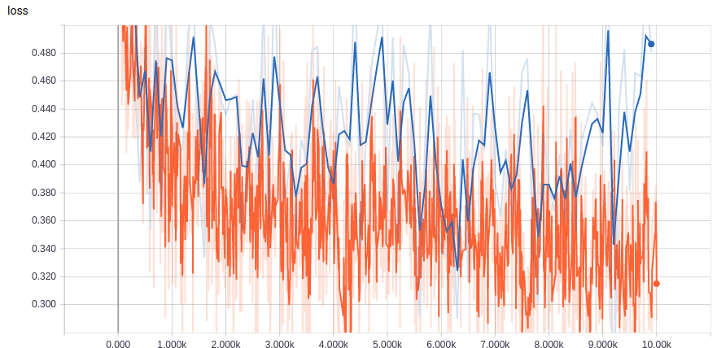

# fundus_binary_classification
## 眼底图二分类——inception v3 迁移学习
参考[https://blog.csdn.net/White_Idiot/article/details/78816850](https://blog.csdn.net/White_Idiot/article/details/78816850)
tensorflow 实现谷歌[INCEPTION-V3](https://storage.googleapis.com/download.tensorflow.org/models/inception_dec_2015.zip)迁移学习

    LEARNING_RATE = 0.01
    STEPS = 10000
    BATCH = 100
    CHECKPOINT_EVERY = 100
    NUM_CHECKPOINTS = 5
    VALIDATION_PERCENTAGE = 10 
    TEST_PERCENTAGE = 10 

## 图像对比
* 正样本
 
* 负样本
 

## Dependencies
* tensorflow

 
其中，训练集正负样本各约3600

训练数据集： data/

训练：

    python train.py

验证：
    python validation.py

## result
    Validation accuracy on random sampled 100 examples = 83.2%

